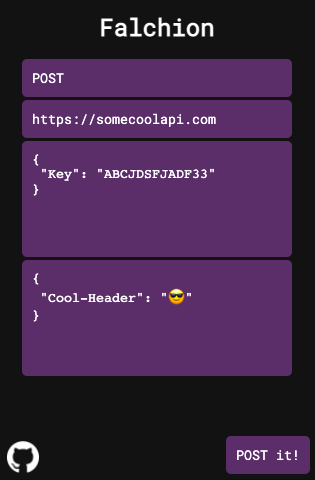

<h1 align="center">

<strong>Falchion</strong></h1>

Falchion is a browser extension which lets you make POST, PUT, DELETE and more requests from the browser.

---

# Features

- Make any method request from the browser.
- Add body or headers (only supports JSON as of now).
- Display the results in a browser tab.

# How To Install
Since Google has this policy of paying $5 to upload 20 extensions on their webstore, I didn't upload it there so you have to install it manually.

- Download the latest (https://github.com/DARKDRAGON532/falchion/releases/)[release].
- Unzip it
- Go to `chrome://extensions`
- Toggle developer mode
- Click `Load Unpacked`
- Locate the file directory and open it.
